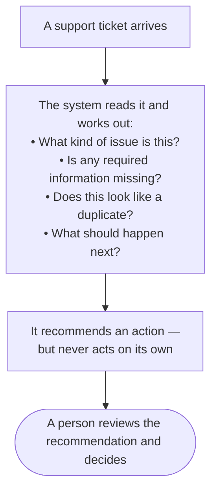
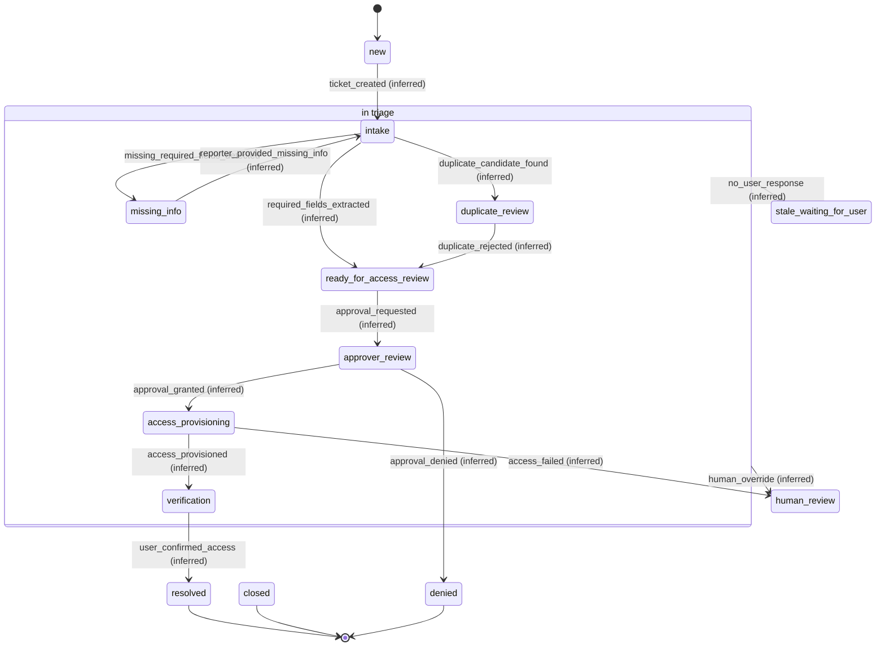
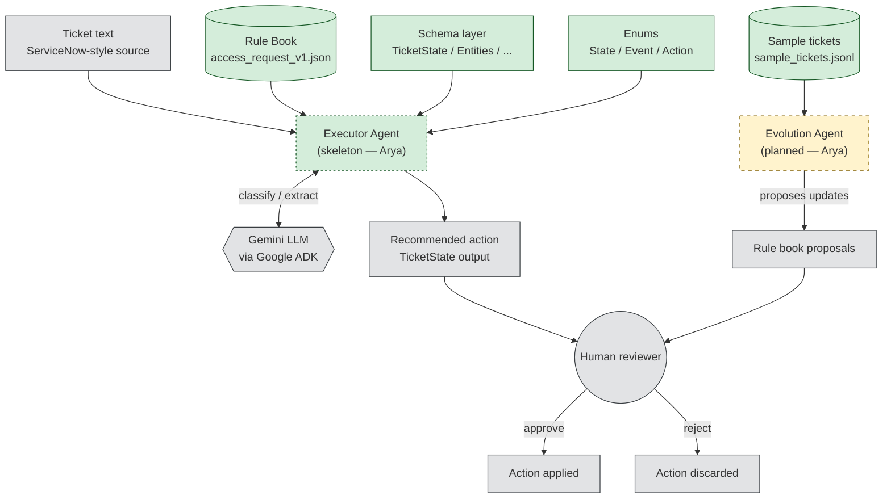

# Architecture — Ticket Triage

> **Status: v0.1 — pending sign-off from Yichen and Arya.**

## How It Works (in plain terms)



This is the high-level idea. The technical diagrams below show the states, components, and data flow in detail.

## 1. System Overview

`ticket_triage` is a **copilot** for application-support ticket triage. It watches ServiceNow-style access-request tickets, classifies them, checks for missing information or likely duplicates, and *recommends* the next action. A human reviews and applies the recommendation; v1 does not mutate real tickets on its own.

The system is driven by a state machine and a JSON **rule book**, not by hard-coded triage logic in Python. The executor agent (`root_agent` in `agent.py`) and its `classify_ticket` / `get_next_action` tools now exist as **skeletons** on `main` — enough to import and wire, not yet enough to run end-to-end. The `template_evolution_agent` is still **planned**. Schema, enums, rule-book loader, and sample tickets are built; agent internals (prompt design, tool behavior, evolution logic) remain Arya's lane.

## 2. Design Principle — Predefined Lists + Agentic Inference

The spec is explicit about the split (from `access_issue_state_machine.md`):

> **Predefined lists control the workflow. Agentic inference fills in evidence and values inside that workflow.**

Concretely, the enums (states, events, action types, entity fields) and the rule book (required fields, allowed events per state, allowed actions per state, transitions) are **fixed by humans**. The LLM contributes *inside* those fixed rails: it extracts entity values, picks among the enumerated actions, generates human-readable rationale.

Why the constraint matters:

- **Debuggability.** State transitions are enumerable. When the agent picks a wrong recommendation, the wrong path is a small set of enum values to inspect, not an open-ended LLM decision.
- **Testability.** Every transition and every action is a symbol we can assert against. `tests/test_schema.py` and `tests/test_rulebook.py` demonstrate this — the schema and rule book are validated the same way in every environment.
- **Safety.** The LLM cannot invent an action outside `RecommendedActionType`, cannot invent a state outside `State`. Failure modes stay inside a known bag.

## 3. Ticket Lifecycle — State Transitions



Transitions in this diagram reflect the current rule book. Items in `access_request_v1.json`'s `todo_transitions` are omitted pending Yichen's sign-off — see [Open Questions](#9-open-questions).

Every transition is labeled with the event that triggers it. Only `intake → missing_info` on `missing_required_fields_detected` is spec-explicit (it appears literally in the ABP-1007 example). Every other transition is marked `(inferred)` because it is read from state and event names rather than stated in the spec.

## 4. System Architecture



Legend:

- **Green solid** — built and tested in this repo (schema, enums, rule book, sample tickets).
- **Green dashed** — built as a skeleton on `main` (`ticket_executor_agent` — enough to import and wire; not yet enough to run end-to-end).
- **Yellow dashed** — still planned (`template_evolution_agent`).
- **Grey** — external systems (Gemini LLM, human reviewer, source-of-ticket, and the outputs downstream of review).

The two agents are shown as opaque boxes on purpose. Their internal structure (tool use, prompt design, chain-of-thought choices) is Arya's design and out of scope for this doc.

## 5. Data Flow — Executor Processing Stages

The executor's per-ticket processing pipeline is distinct from the lifecycle states in Section 3. Where Section 3 answers "what state is the ticket in?", this answers "what is the executor doing to process it, in order?":

```text
intake
→ classification
→ duplicate_check
→ required_info_review
→ action_recommendation
→ human_review
```

Each stage is a step in producing one `TicketState` output. A ticket may exit the pipeline early — e.g. an `intake` stage that yields `missing_info` writes the state, records the recommended `ask_for_missing_info` action, and finishes; the reporter reply re-enters the pipeline as a new run.

## 6. Module Structure

| Path | Purpose | Status |
| --- | --- | --- |
| `ticket_triage/enums.py` | The vocabulary — `State`, `Event`, `RecommendedActionType`, `EntityField`, `PrimaryCategory`, `ApprovalStatus` | Built |
| `ticket_triage/schema.py` | The contract — Pydantic models for `TicketState`, `Entities`, `Approval`, `RecommendedAction`, `AuditEntry`, `DuplicateCandidate` | Built |
| `ticket_triage/rulebook.py` | The loader — `Rulebook` model, `Transition` model, `load_rulebook()`, `RulebookLoadError` | Built |
| `ticket_triage/templates/` | The rule books — currently `access_request_v1.json` | Built (1 rulebook) |
| `ticket_triage/data/` | Sample tickets — `sample_tickets.jsonl` with 10 scenarios | Built |
| `ticket_triage/agent.py` | ADK agent wiring (`root_agent` + tools) | Built (skeleton) — Arya's lane |
| `ticket_triage/domain/classification.py` | `classify_ticket()` tool | Built (skeleton) — Arya's lane |
| `ticket_triage/domain/recommendation.py` | `get_next_action()` tool | Built (skeleton) — Arya's lane |
| `ticket_triage/domain/evolution.py` | Historical-ticket analysis + rule-book proposals | Planned — Arya's lane |
| `tests/` | Schema, rule-book, sample-ticket, and recommendation validation | Built (44 tests; 38 pass, 6 xfail documenting the recommendation cascade gap) |

## 7. Agent-Layer Boundary — Provisional

The contract between the built layer and Arya's planned layer is:

- **In:** ticket text (raw), the loaded `Rulebook`, the enums.
- **Out:** a `TicketState` instance whose `recommended_action.type` is a member of `RecommendedActionType`.

That is the entire surface Arya's code must satisfy. Everything else — prompt design, tool use, whether the executor runs the LLM once or in stages, how confidence is computed — is internal to the agent and deliberately left undesigned here.

`agent.py`, `domain/classification.py`, and `domain/recommendation.py` now exist as skeletons on `main` (see PR #4). `domain/evolution.py` is still planned. The current skeleton is enough to import — `from ticket_triage.agent import root_agent` returns an `LlmAgent` instance — but running the executor end-to-end still needs the prompt design and per-tool behavior that lives in Arya's follow-ups.

## 8. Markdown / JSON Twin

The rule-book file exists in two forms: `access_issue_state_machine.md` (human-authored source of truth, at the repo root) and `ticket_triage/templates/access_request_v1.json` (derived, machine-loadable). Markdown wins when they disagree.

See [ADR 0001 — Rule Book Format](docs/decisions/0001-rulebook-format.md) for the full rationale and the drift-resolution policy.

## 9. Open Questions

| Question | Current State | Who Decides |
| --- | --- | --- |
| `ask_for_info` vs `ask_for_missing_info` (spec inconsistency between line 116 enum list and line 176 example) | Enum uses canonical `ask_for_missing_info`; test flags the discrepancy | Yichen |
| Which entity fields beyond `employee_id` are truly required for triage to advance? | Only `employee_id` in `required_fields`; other 7 in `provisional_required_fields` with a note | Yichen |
| `allowed_events_per_state` — spec does not enumerate | Populated by inference in `access_request_v1.json`; flagged in `notes` | Yichen |
| `allowed_actions_per_state` — spec does not enumerate | Populated by inference in `access_request_v1.json`; flagged in `notes` | Yichen |
| 8 ambiguous `todo_transitions` (e.g. what `duplicate_confirmed` moves to; what states `human_override` applies from) | Listed in `todo_transitions`, omitted from `transitions` list | Yichen |
| `DuplicateCandidate` shape — spec only shows an empty array | Provisional shape: `issue_id`, `similarity_score`, `reason` | Yichen |
| `ApprovalStatus` values — only `not_requested` in the example | Enum inferred from event names: `not_requested`, `requested`, `granted`, `denied` | Yichen |
| Executor and evolution agent internals (prompt design, tool use, model choice) | Not yet designed | Arya |
| Choice of Gemini API path (AI Studio vs Vertex AI) for production | Local dev defaults to AI Studio; production choice deferred | Manager |

**Documentation fixes shipped in this PR:** `readme.md` and `CLAUDE.md` referenced a rule-book filename (`state_machine.v1.md` / `state_machine.v1.json`) that never existed in the built repo. All four dead references are corrected to `access_request_v1.json` / `access_issue_state_machine.md`. The `readme.md` state-flow example in "Core Idea" and the per-state bullets are rewritten to reflect the real 13-state machine instead of the previous 6-step abstract flow. `Example: Access Request` (employer id / `ask_for_info` wording) is deliberately left untouched; both inconsistencies are captured in the table above for Yichen to resolve.

---


